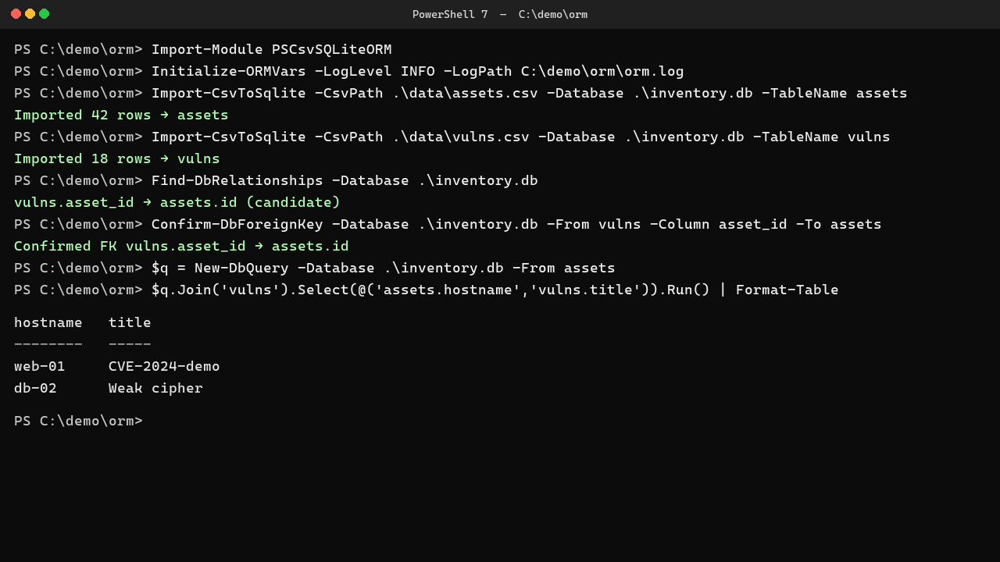

# PSCsvSQLiteORM

Load CSV files into SQLite and work with the result as PowerShell objects.

The module infers a schema from CSV headers, generates a class per table, discovers and enforces foreign keys,
and gives you a query builder, upserts and migrations on top. It targets scripts that have to turn exported
data into something queryable without standing up a database server, and it runs on Windows PowerShell 5.1 as
well as PowerShell 7.

| | |
|---|---|
| **PowerShell** | Windows PowerShell 5.1, or PowerShell 7 |
| **Requires** | [PSSQLite](https://www.powershellgallery.com/packages/PSSQLite) 1.1.0 or later |
| **Version** | 3.2.0 ([changelog](CHANGELOG.md)) |
| **Reference** | [docs/reference.md](docs/reference.md), or `Get-Help about_PSCsvSQLiteORM` |
| **Licence** | [GNU General Public License v2.0](LICENSE) |

## Demo



## Quick Start

### 1. Install Dependencies
```powershell
# Install required PSSQLite module
Install-Module PSSQLite -Scope CurrentUser

# Install PSCsvSQLiteORM from PowerShell Gallery (latest version)
Install-Module PSCsvSQLiteORM -Scope CurrentUser

# Or install specific version 3.2.0
Install-Module PSCsvSQLiteORM -RequiredVersion 3.2.0 -Scope CurrentUser
```
`New-DynamicRecord` (step 6), `Remove-DbForeignKey` and `Test-DbTransaction` (step 9) do not exist in 3.1.3 or
earlier, so pin 3.2.0 or later.

### 2. Initialize the ORM
```powershell
# Import the module
Import-Module PSCsvSQLiteORM

# Initialize with logging (optional but recommended)
Initialize-ORMVars -LogLevel DEBUG -LogPath 'C:\temp\orm.log'

# Or use a settings file for configuration (a sample ships as Examples\orm.settings.ps1 inside the module folder)
Initialize-ORMVars -SettingsPath .\orm.settings.ps1
```
A settings script returns a hashtable with `DbPath`, `LogPath` and `LogLevel`; explicit parameters win over the
file. See [logging and configuration](docs/reference.md#logging-and-configuration).

### 3. Import CSV Data
```powershell
# Import CSV files into the SQLite database (the table is created from the CSV headers)
Import-CsvToSqlite -CsvPath .\data\assets.csv -Database .\myapp.db -TableName assets
Import-CsvToSqlite -CsvPath .\data\vulns.csv -Database .\myapp.db -TableName vulns

# Append more rows to a table that already exists without touching its schema (optional)
Import-CsvToSqlite -CsvPath .\data\assets_more.csv -Database .\myapp.db -TableName assets -SchemaMode AppendOnly

# Discover foreign keys from *_id column names, then confirm the ones you want.
# Confirmed relationships drive 'Auto' joins (step 5) and GetHasMany()/GetBelongsTo() navigation (step 6).
Find-DbRelationships -Database .\myapp.db
Confirm-DbForeignKey -Database .\myapp.db -From vulns -Column asset_id -To assets
```
The table is created from the headers, column types are inferred from the values, and the command returns the
trimmed header names. `-SchemaMode` decides how much an import may change an existing table: `Relaxed` (the
default) adds columns and widens types, `Strict` requires the table to match, `AppendOnly` only inserts rows.

`Confirm-DbForeignKey` enforces the relationship with triggers and refuses data that already violates it; pass
`-Force` to record it for future writes only.

Read before you import production data: [schema modes](docs/reference.md#schema-modes),
[what the import does to the values it reads](docs/reference.md#what-the-import-does-to-the-values-it-reads),
[`id` columns and uniqueness](docs/reference.md#id-columns-and-uniqueness) and
[foreign keys](docs/reference.md#foreign-keys).

### 4. Generate Dynamic Models
```powershell
# Update the catalog and export model types
$types = Export-DynamicModelsFromCatalog -Database .\myapp.db

# Create PowerShell classes from the models
Set-DynamicORMClass
```
One class per table, named `Dynamic` plus the table name in PascalCase, with an accessor for every column
except `id`, which is the `.Id` property. The classes are only resolvable inside the module, so build
instances with `New-DynamicRecord` (step 6) rather than `New-Object`. See
[dynamic models](docs/reference.md#dynamic-models).

### 5. Query Your Data
```powershell
# Create a query builder instance
$query = New-DbQuery -Database .\myapp.db -From 'assets'

# Add conditions (named parameters) and execute
$results = $query.Where('hostname = @host', @{ host = 'server01' }).Run()

# Or join related data with an explicit ON clause: Join(<table>, <on>, <Inner|Left|Right|Full>)
$query = New-DbQuery -Database .\myapp.db -From 'assets'
$results = $query.Join('vulns', 'vulns.asset_id = assets.id', 'Left').Select(@('assets.*', 'vulns.title AS vuln_title')).Run()

# Join(<table>, <on>) is an INNER join; Join(<table>) is an INNER join on the catalog relationship ('Auto')
$query = New-DbQuery -Database .\myapp.db -From 'assets'
$results = $query.Join('vulns', 'vulns.asset_id = assets.id').Select(@('assets.hostname', 'vulns.title')).Run()

# Join(<table>, 'Auto', <type>, <foreign key>) picks the foreign key when a table has several to one parent
$query = New-DbQuery -Database .\myapp.db -From 'vulns'
$results = $query.Join('assets', 'Auto', 'Inner', 'asset_id').Select(@('vulns.title', 'assets.hostname')).Run()

# Order, page and let the catalog supply the ON clause ('Auto' uses the relationship confirmed in step 3)
$query = New-DbQuery -Database .\myapp.db -From 'vulns v'
$results = $query.Join('assets a', 'Auto', 'Inner').Select(@('v.*', 'a.hostname')).OrderBy('v.id DESC').Limit(2).Offset(1).Run()
```
`Run()` always returns an array. `Where()` takes a SQL fragment plus a parameter hashtable and binds the
values, and its clauses are combined with `AND`. `Right` and `Full` joins are emulated, because SQLite before
3.39 has no native support. See [query builder](docs/reference.md#query-builder).

### 6. Work with Dynamic Models
```powershell
# Get a record object for a table (after Export-DynamicModelsFromCatalog / Set-DynamicORMClass)
$asset = New-DynamicRecord -Table 'assets' -Database .\myapp.db

# Create a new row: set column values through the generated accessors, then Save()
$asset.hostname('server04')
$asset.ip('192.168.1.13')
$asset.Save()
$asset.Id            # id assigned by SQLite

# Find and update an existing row
$found = $asset.FindById(1)
$found.ip('10.0.0.1')
$found.Save()

# Query rows and navigate the relationships confirmed in step 3 (Confirm-DbForeignKey)
$rows = $asset.Where('ip LIKE @net', @{ net = '192.168.%' })
$vulns = $found.GetHasMany('vulns')       # DynamicVulns records
$owner = $vulns[0].GetBelongsTo('assets')  # back to the DynamicAssets record

# All() returns records; AllRows() returns the same rows as plain objects with no record API
$records = $asset.All()
$plain = $asset.AllRows()

# Delete a row (the one saved above, which has no child rows)
$asset.Delete()
```
A record is both an unsaved row you `Save()` and the entry point for its table's finders (`FindById()`,
`Where()`, `First()`, `All()`), which hand back new records without changing the one you called them on.
See [records](docs/reference.md#records).

### 7. Upserts and Tables Without an `id` Column
```powershell
# Insert or update by key column(s); a UNIQUE index on the key columns is created if missing
$asset.InsertOnConflict(@{ hostname = 'server01'; ip = '10.0.0.1' }, @('hostname'), $null)
$asset.BulkUpsert(@(@{ hostname = 'a'; ip = '1' }, @{ hostname = 'b'; ip = '2' }), @('hostname'))
# Explicit UpdateSet: a row-column reference, a bound literal value, and a raw SQL expression
$asset.InsertOnConflict(@{ hostname = 'server01'; ip = '10.0.0.2' }, @('hostname'), @{ ip = 'excluded.ip' })
$asset.InsertOnConflict(@{ hostname = 'server01'; ip = '10.0.0.2' }, @('hostname'), @{ ip = 'fixed literal' })
$asset.InsertOnConflict(@{ hostname = 'server01'; ip = '10.0.0.2' }, @('hostname'), @{ ip = @{ Sql = "excluded.ip || '-x'" } })
# Bulk rows may be hashtables or objects with properties (Import-Csv output, [pscustomobject])
$asset.InsertMany(@([pscustomobject]@{ hostname = 'c'; ip = '3' }))
```
A table with no `id` column uses SQLite's `rowid` as the record key, so its records still update in place
rather than inserting duplicates. On Windows PowerShell 5.1 the bundled SQLite is older than 3.24 and the
upsert is emulated. See [upserts](docs/reference.md#upserts-and-tables-without-an-id-column).

### 8. Validation and Callbacks
```powershell
$asset.AddValidator('hostname', 'Required', $null)
$asset.On('BeforeSave', { param($record) if ($record.GetAttribute('ip') -eq '0.0.0.0') { throw 'ip not allowed' } })
$asset.On('AfterSave', { param($record) Write-Host "saved $($record.Id)" })
```
A `Before` callback that throws stops the write. An `After` callback runs only once the SQL succeeded, and its
own exceptions are logged rather than propagated. See
[validation and callbacks](docs/reference.md#validation-and-callbacks).

### 9. Transactions, Raw SQL and Maintenance
```powershell
# Every statement for one database goes through one pooled connection, so an open transaction takes in
# every later write on that database until it is completed
$tx = Start-DbTransaction -Database .\myapp.db
Test-DbTransaction -Database .\myapp.db
Complete-DbTransaction -Database .\myapp.db -Transaction $tx

# Complete and Undo also accept -Database alone, to finish a transaction whose handle the script has lost
Start-DbTransaction -Database .\myapp.db | Out-Null
Undo-DbTransaction -Database .\myapp.db

# Raw SQL: parameters are bound, never interpolated. -Scalar returns the first cell
Invoke-DbQuery -Database .\myapp.db -Query 'SELECT COUNT(*) AS c FROM assets' -Scalar

# Drop a relationship and its triggers before dropping a table that takes part in it
Remove-DbForeignKey -Database .\myapp.db -From vulns -Column asset_id

# Release the file when the script is finished with it
Close-DbConnections
```
`Close-DbConnections` and `Initialize-ORMVars` roll an uncommitted transaction back with a warning rather than
discarding it silently, and `Complete-DbTransaction` / `Undo-DbTransaction` accept `-Database` alone when the
handle has been lost. See
[transactions, raw SQL and maintenance](docs/reference.md#transactions-raw-sql-and-maintenance).

### 10. Schema Migrations
```powershell
# Apply a one-way schema change once per database, identified by version
Add-DbMigration -Database .\myapp.db -Version '001-add-owner' -Up {
    param($Database)
    Invoke-DbQuery -Database $Database -Query 'ALTER TABLE assets ADD COLUMN owner TEXT' -NonQuery
}

# Applied versions, in the order they were applied
Get-AppliedMigrations -Database .\myapp.db
```
Migrations are one-way. There is no command that reverts one, and the `-Down` parameter `Add-DbMigration`
accepts is never stored and never executed, so undoing a change means writing a later migration. A version
already applied is skipped, which lets a script call the same migration on every run, and `-Up` runs inside a
transaction with its bookkeeping row, so a migration that throws leaves nothing behind. See
[migrations](docs/reference.md#migrations).

## Commands

| Area | Commands |
|---|---|
| Import and schema | `Import-CsvToSqlite`, `Test-ColumnTypes`, `Initialize-Db`, `Update-DbCatalog`, `Get-TableColumns` |
| Relationships | `Find-DbRelationships`, `Confirm-DbForeignKey`, `Remove-DbForeignKey`, `Enable-ForeignKeysPragma` |
| Models and records | `Export-DynamicModelsFromCatalog`, `Set-DynamicORMClass`, `New-DynamicRecord`, `New-DynamicModel` |
| Queries | `New-DbQuery`, `Invoke-DbQuery` |
| Transactions | `Start-DbTransaction`, `Complete-DbTransaction`, `Undo-DbTransaction`, `Test-DbTransaction` |
| Upserts | `Enable-UniqueIndex`, `Enable-UpsertSupported` |
| Migrations | `Add-DbMigration`, `Get-AppliedMigrations` |
| Configuration and logging | `Initialize-ORMVars`, `Set-DbLogging`, `Write-DbLog` |
| Connections | `Get-DbConnection`, `Close-DbConnections` |
| Helpers | `ConvertTo-Ident` |

`Get-Help <command> -Full` for parameters, and [docs/reference.md](docs/reference.md) for the behaviour behind
them.

## Building from source

```powershell
pwsh -NoProfile -File .\build-module.ps1
Invoke-Pester -Path .\Tests
```

The build writes `output\PSCsvSQLiteORM\<version>\` using [ModuleBuilder](https://github.com/PoshCode/ModuleBuilder)
and fails if the docs or the sample settings file do not reach it. The test suite runs on Windows PowerShell 5.1
and on PowerShell 7, and executes every code block in sections 3 to 10 of this file line by line, so an example
that stops working fails the build.
